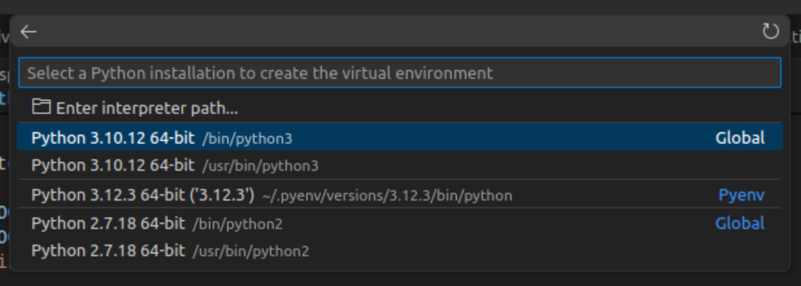

# Linux Ununtu DevBox setup


Ubuntu 22.04 comes with Python `3.10.12`.


How to install and manange other version of Python interpertors?
`/usr/bin/python3`

# Displays all of the installed dependencies

```bash
apt list --installed | grep python
```

## Installing multiple versions of Python and switching between them


[`pyenv`](https://github.com/pyenv/pyenv) is like [`nvm`](https://github.com/nvm-sh/nvm) utility for nodejs.

An Alternative method is to use `apt`

```bash
    sudo add-apt-repository ppa:deadsnakes/ppa
    sudo apt-get update
    sudo apt-get install python3.5
```

## Install [pyenv](https://github.com/pyenv/pyenv)

### Instal dependeces

This script clones the repo with all of the shell scripts.

```bash
    # prereq
    sudo apt install libedit-dev
    sudo apt uninstall python3-pip
    sudo apt-get install build-essential zlib1g-dev libffi-dev libssl-dev libbz2-dev libreadline-dev libsqlite3-dev liblzma-dev
    sudo apt-get install python-tk python3-tk tk-dev
```

### Install `pyenv`

```bash
    $ curl https://pyenv.run | bash
```

### Update `~/.bashrc` file

Add the following to the end of `~/.bashrc` file.

```bash
    export PYENV_ROOT="$HOME/.pyenv"
    [[ -d $PYENV_ROOT/bin ]] && export PATH="$PYENV_ROOT/bin:$PATH"
    eval "$(pyenv init -)"

    #BUILD LOCATION
    export TMPDIR="$HOME/.pyenv-tmp"
   
    # LOAD VENV
    # Load pyenv-virtualenv automatically by adding
    # the following to ~/.bashrc:
    eval "$(pyenv virtualenv-init -)"
```

### Install latest version of Python

```bash

    pyenv install --list | grep " 3\.[12]"
    
    # dowloads bits and build it on the machine.
    pyenv install  3.12.3
    
    #pyenv uninstall
    
    pyenv versions
    
    pyenv global 3.12.3
```



[pyenv-virtualenv](https://github.com/pyenv/pyenv-virtualenv)

### Install Aider Or Poerty virtual enviroments

Once we have multipe python version running, there are sometimes a neeed to have a pre loaded global dependecies to be used for the project.

[aider](https://github.com/paul-gauthier/aider)

```bash
    # create an enviroment
    pyenv virtualenv 3.12.3 aider

    # to display newly created copy 
    pyenv versions

    # activate now
    pyenv activate aider
    
    # deactivate
    pyenv deactivate

    # install aider
    pip install aider-chat

    # to see number of package that were installed
    pip freeze | wc -l
    
```


## References

-[pyenvs-python-is-missing-bzip2-module](https://stackoverflow.com/questions/60775172/pyenvs-python-is-missing-bzip2-module)
-[How do I install a different Python version using apt-get?](https://askubuntu.com/questions/682869/how-do-i-install-a-different-python-version-using-apt-get)
-[Managing multiple Python versions on Ubuntu/Pop!_OS](https://medium.com/@kameshwarasekar/managing-multiple-python-versions-on-ubuntu-pop-os-eae4d0bf3171)